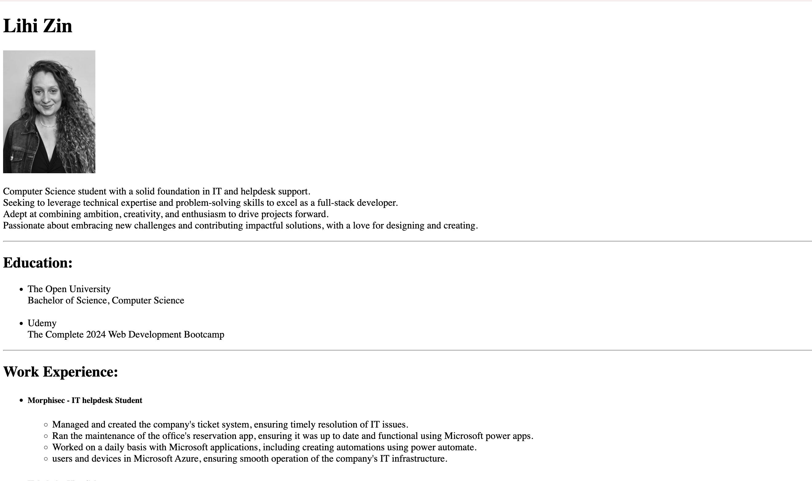

# MyResume

This project was developed as part of the Complete 2024 Web Development Bootcamp.  
The goal of the project was to practice core web development skills including HTML, CSS, JavaScript, and backend development.

## 📝 Overview

In this project I built a [short description of what it does — e.g., "personal portfolio website" / "e-commerce store demo" / "blog platform"]  
Key functionalities include:

- Responsive web design
- User-friendly interface
- Integration with [e.g., a backend API / database / other tools]

## 🎯 Learning Outcomes

Through this project I strengthened my skills in:

- Frontend development with HTML, CSS, JavaScript
- Backend basics (Node.js / Python / any other tech used)
- Git version control and collaboration
- Deploying a web application

## 🚀 Screenshot

## 🔍 Note

This project is for portfolio demonstration purposes only.
